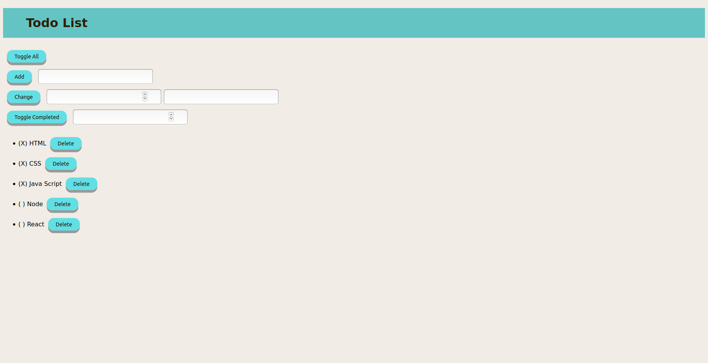

# Practical-Javascript

A static web page for `todo List` built with only HTML, CSS & JavaScript.

Try the live demo [right here](https://ayseakyol.github.io/practical-javascript/), it looks something like this:

---

## Notes

Studying this project I learned about:

- Using for loops, forEach, slice, push etc.
- Using call back functons.
- Changing functions to methods in the objects.
- Using `this`.

We struggled with:

- I have a little difficulty while seperating files.

---

> - Code refactored from [Watch and Code ](https://watchandcode.com/)
